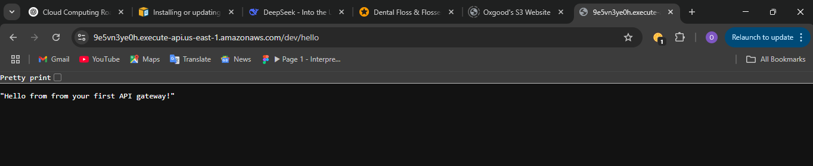

# 🔌 API Gateway + Lambda Integration

This mini-project demonstrates a basic **serverless REST API** using **Amazon API Gateway** and **AWS Lambda**.

---

## 🔧 What I Did

### 1️⃣ Created a Lambda Function
- Runtime: **Python 3.13**
- Simple function that responds with a JSON message

```python
def lambda_handler(event, context):
    return {
        'statusCode': 200,
        'body': 'Hello from Lambda behind API Gateway!'
    }
```

2️⃣ Connected API Gateway
Used API Gateway (REST API) to expose the Lambda function to the public

Chose integrations > Lambda function and linked it

Chose ANY method for simplified testing

Used auto-deploy option to make changes go live instantly

3️⃣ Tested the API
Opened the public URL provided by API Gateway

Got response: Hello from Lambda behind API Gateway!

Validated that Lambda triggers on each request

🧠 Concept Covered
Serverless execution using Lambda

REST endpoint setup using API Gateway

Event-driven trigger from API Gateway → Lambda

Public HTTP interface without a backend server

🧰 Tools Used
AWS Lambda

API Gateway (REST API)

Python 3.13

📸 Screenshot


Successful GET request triggering the Lambda function via API Gateway.

🔐 Security Note
This was a public endpoint for learning purposes. In real-world applications:

Add authentication (API Key, Cognito, IAM)

Set CORS headers if connecting to frontend

Use throttling, WAF, and logging for production

💡 Why This Matters
This architecture is the foundation of modern serverless APIs — fully managed, highly scalable, and low cost. No servers to patch or maintain!