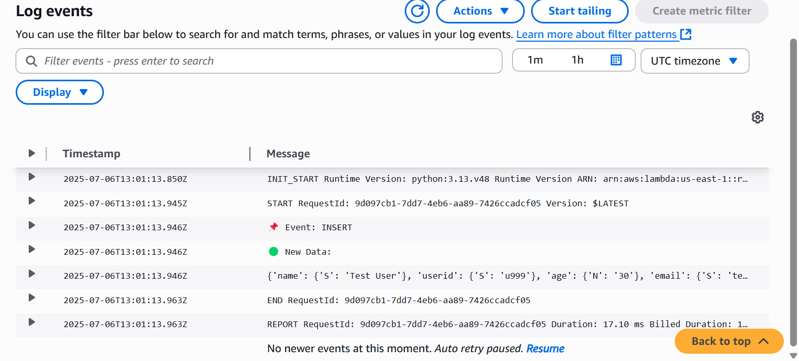

# 🔁 DynamoDB Stream Triggering a Lambda Function

This setup demonstrates a real-time integration between Amazon DynamoDB and AWS Lambda using DynamoDB Streams. Whenever a new item is added to the `Users` table, a Lambda function is triggered to process that change.

---

## 📦 What Was Done

### 1️⃣ Enabled DynamoDB Streams
- Stream type: **New image**
- Table: `Users`

### 2️⃣ Created a Lambda Function
- Name: `processUserStream`
- Runtime: Python 3.13
- IAM Role: Attached with permissions:
  - `AmazonDynamoDBReadOnlyAccess`
  - `AWSLambdaBasicExecutionRole`
  - Custom inline policy for:
    - `dynamodb:GetRecords`
    - `dynamodb:GetShardIterator`
    - `dynamodb:DescribeStream`
    - `dynamodb:ListStreams`

#### Lambda Code:
```python
def lambda_handler(event, context):
    for record in event['Records']:
        if record['eventName'] == 'INSERT':
            new_item = record['dynamodb']['NewImage']
            userid = new_item['userid']['S']
            email = new_item['email']['S']
            print("🟨 DynamoDB Stream Triggered")
            print(f"🔑 UserID: {userid}")
            print(f"📧 Email: {email}")
```


3️⃣ Connected DynamoDB Stream to Lambda
Set as a trigger.

Initially disabled due to missing stream permissions.

Granted correct IAM access → Trigger enabled.

✅ Test Performed
Inserted a new item via CLI:

```
aws dynamodb put-item \
  --table-name Users \
  --item '{\"userid\": {\"S\": \"u999\"}, \"name\": {\"S\": \"Test User\"}, \"email\": {\"S\": \"test@example.com\"}, \"age\": {\"N\": \"30\"}}' \
  --profile readonly
```
🔍 Verified CloudWatch Logs:



💡 Why It Matters
This setup showcases event-driven architecture where your backend reacts in real-time to data changes. It's ideal for use cases like:

Triggering downstream processing when users are added

Auditing data changes

Real-time notifications and analytics


