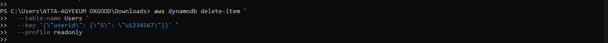

🗃️ DynamoDB CRUD Operations via AWS CLI
This mini project demonstrates full Create, Read, Update, and Delete operations on a DynamoDB table using AWS CLI and PowerShell — with proper IAM access controls.

🧾 Table Setup
Table Name: Users

Primary Key: userid (String)

🔐 IAM Setup
IAM Role/User with permission: AmazonDynamoDBFullAccess

Profile used in CLI: readonly (configured earlier for all AWS CLI interactions)


🔨 Operations Performed
✅ Create (Put Item)

```
aws dynamodb put-item `
  --table-name Users `
  --item '{\"userid\": {\"S\": \"u1234567\"}, \"name\": {\"S\": \"lord\"}, \"email\": {\"S\": \"lord@example.com\"}, \"age\": {\"N\": \"22\"}}' `
  --profile readonly
```
🔍 Read (Get Item)


```
aws dynamodb get-item `
  --table-name Users `
  --key '{\"userid\": {\"S\": \"u1234567\"}}' `
  --profile readonly
```
✏️ Update (Using Put to overwrite)


```
aws dynamodb put-item `
  --table-name Users `
  --item '{\"userid\": {\"S\": \"u1234567\"}, \"name\": {\"S\": \"Lord Updated\"}, \"email\": {\"S\": \"lord.updated@example.com\"}, \"age\": {\"N\": \"23\"}}' `
  --profile readonly
```
Note: put-item replaces the entire item if it already exists.


Update Item

```
aws dynamodb update-item `
   --table-name Users `
   --key '{\"userid\": {\"S\": \"u1234567\"}}' `
   --update-expression "SET #n = :newname" `
   --expression-attribute-names '{\"#n\": \"name\"}' `
   --expression-attribute-values '{\":newname\": {\"S\": \"kwame\"}}' `
   --profile readonly
```


🗑️ Delete (Remove Item)

```
aws dynamodb delete-item `
  --table-name Users `
  --key '{\"userid\": {\"S\": \"u1234567\"}}' `
  --profile readonly
```



🧪 Testing & Validation
Verified each operation using both the CLI and AWS Console.

Observed real-time sync between terminal actions and console UI.

Demonstrated secure, role-based access without hardcoded credentials.


*Full CRUD operation demo via AWS CLI on a 'Users' table*


💡 Why This Matters
This demonstrates how AWS CLI can be used to manage real-time NoSQL data in DynamoDB, ideal for serverless and microservice-based applications. You also get familiar with:

JSON syntax for CLI input

IAM-based permission control

Real-world scripting experience with DynamoDB

