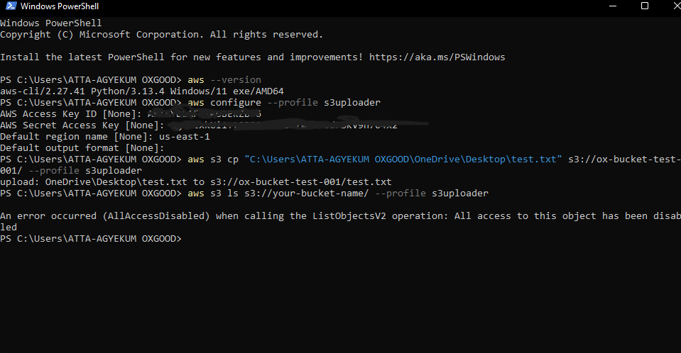

# IAM User for S3 Upload via AWS CLI

### 📦 Summary
This folder documents the creation and usage of a limited-permission IAM user that can upload files to an S3 bucket using the AWS CLI.

### 🛠️ What I Did
- Created a custom IAM policy that allows `s3:PutObject` only on a specific S3 bucket
- Created a new IAM user with programmatic access and attached that custom policy
- Configured the AWS CLI using `aws configure --profile s3uploader`
- Successfully uploaded files to S3 using the CLI with this user
- Verified that the user could not perform any other action like `s3 ls`


## 🖼️ Screenshots


### 🔐 IAM Policy Used
```json
{
  "Version": "2012-10-17",
  "Statement": [
    {
      "Sid": "AllowUploadToSpecificBucket",
      "Effect": "Allow",
      "Action": [
        "s3:PutObject"
      ],
      "Resource": "arn:aws:s3:::oxgood-static-hosting/*"
    }
  ]
}
