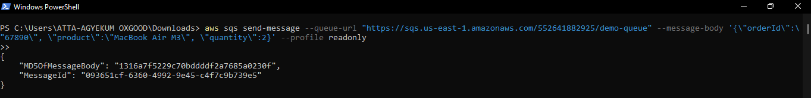
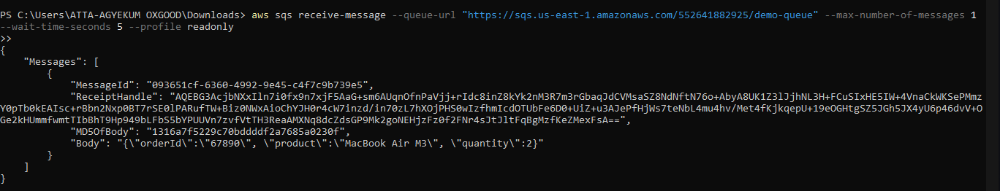
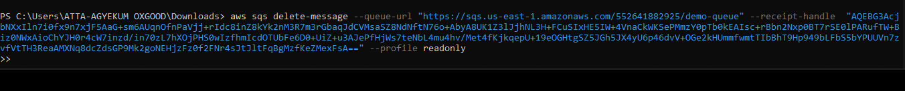

# 🟨 Amazon SQS Queue Demo (CLI-Based)

This demo shows how to send, receive, and delete messages from an AWS SQS Standard Queue using the AWS CLI.

---

## 🔧 What I Did:

### 1️⃣ Created a Standard Queue in SQS Console
- Queue Name: `demo-queue`
- Type: Standard
- Kept all default settings

---

### 2️⃣ Sent a Message Using CLI

Used the following AWS CLI command in PowerShell to send a message:

```bash
aws sqs send-message --queue-url "https://sqs.us-east-1.amazonaws.com/552641882925/demo-queue" --message-body '{\"orderId\":\"67890\", \"product\":\"MacBook Air M3\", \"quantity\":2}' --profile readonly
```

screenshot

 Message sent successfully!

3️⃣ Received Message via CLI
```bash
Copy
aws sqs receive-message \
  --queue-url https://sqs.us-east-1.amazonaws.com/552641882925/demo-queue \
  --max-number-of-messages 1 \
  --profile readonly
```

screenshot

Retrieved message body


Noted the ReceiptHandle required for deletion

4️⃣ Deleted Message from Queue
```bash
aws sqs delete-message \
  --queue-url https://sqs.us-east-1.amazonaws.com/552641882925/demo-queue \
  --receipt-handle <paste-your-receipt-handle-here> \
  --profile readonly
```

screenshot

🧹 Successfully deleted the message from the queue!

💡 Why This Matters
This proves how SQS can be used to:

Queue background tasks

Buffer high-load systems

Communicate between microservices

Trigger events in serverless architectures

CLI gives developers the power to automate message handling and integrate with other scripts and tools.


🔐 Security
IAM user had read/write access only to SQS.

Used --profile readonly to avoid exposing access keys.

No keys hardcoded.
