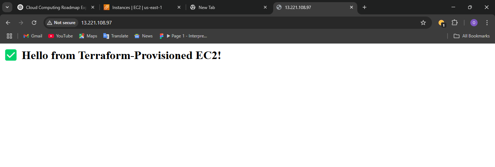

# ⚙️ EC2 with Apache Web Server using Terraform

This project demonstrates how to provision an Amazon EC2 instance with Apache installed, using **Terraform** — a powerful Infrastructure as Code (IaC) tool.

---

## 🚀 What I Did

### 1️⃣ Wrote a `main.tf` Terraform Configuration
- **Provider:** AWS with a specific region (`us-east-1`)
- **Resource:** EC2 instance (`t2.micro`) using Amazon Linux 2
- **User Data:** Shell script to install and start Apache (`httpd`)
- **Tagging:** Labeled instance as `Terraform-EC2`

```hcl
provider "aws" {
  region  = "us-east-1"
  profile = "terraform-user" # or the IAM profile you configured
}

resource "aws_instance" "my_ec2" {
  ami           = "ami-0c02fb55956c7d316"
  instance_type = "t2.micro"
  key_name = "tf-ec2-key" 

  tags = {
    Name = "Terraform-EC2"
  }
}
```


2️⃣ Configured AWS CLI with Terraform Profile
Used:

```
aws configure --profile terraform-user
```

To provide credentials for Terraform to authenticate with AWS.

3️⃣ Deployed Infrastructure

```
terraform init      # Initialize the working directory
terraform plan      # Preview resources to be created
terraform apply     # Create the EC2 instance
```

Verified the instance was launched successfully from the AWS Console.

4️⃣ SSH Access + Apache Verification
Created a key pair (terraform-key.pem)

SSH’d into instance:
ssh -i terraform-key.pem ec2-user@<Public-IP>

run this codes
```
sudo yum update -y
sudo yum install httpd -y
sudo systemctl start httpd
sudo systemctl enable httpd
echo '<h1>✅ Hello from Terraform-Provisioned EC2!</h1>' | sudo tee /var/www/html/index.html
```

Visited the EC2 public IP in a browser and saw the custom Apache page.

📸 Screenshot


Apache web server running on a Terraform-provisioned EC2 instance

💡 Why This Matters
This exercise demonstrates the power of Infrastructure as Code:

Infrastructure is repeatable, shareable, and version-controlled.

No manual clicks — everything runs from code.

Enables automation and consistent environments across teams.

🛡️ Security Notes
Only port 22 (SSH) and 80 (HTTP) allowed in Security Group

EC2 instance launched with least privileges (no unnecessary roles)

🧠 Key Takeaways
Introduced Terraform as a tool for IaC.

Learned how to define, plan, and apply infrastructure changes.

Took first step toward full automation in DevOps and Cloud Engineering.

