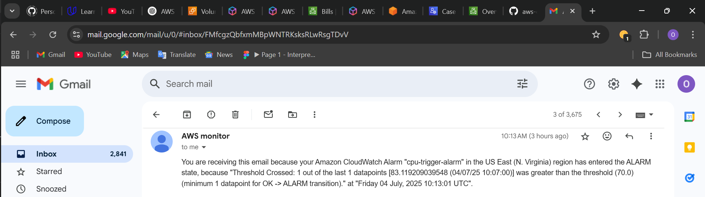

# 🟥 CloudWatch Alarm + SNS Email Alert

This setup demonstrates how to automatically monitor EC2 CPU usage using **Amazon CloudWatch** and trigger an **SNS email alert** when usage crosses a defined threshold.

---

## 🔧 What I Did

### 1️⃣ Created a CloudWatch Alarm
- **Metric**: `EC2 > CPUUtilization`
- **Threshold**: Greater than `70%` for `1 datapoint` within `1 minute`
- **Evaluation period**: 1
- Linked to a specific EC2 instance

### 2️⃣ Created an SNS Topic
- Name: `cpu-alert-topic`
- Created and verified an email subscription (agyekumoxgood@gmail.com)

### 3️⃣ Connected Alarm to SNS
- Edited the CloudWatch alarm to send notifications via `cpu-alert-topic` when state changes to **In Alarm**

### 4️⃣ Simulated High CPU Load
- SSH’d into the EC2 instance using PowerShell
- Ran:

```bash
sudo apt update -y
sudo apt install stress -y
stress --cpu 2 --timeout 120
```

5️⃣ Received Email Alert
Got an email from SNS when CPU usage spiked

Verified alarm changed to "In Alarm" in CloudWatch

🧠 Why This Matters
This is a production-level alerting setup. In real-world systems, alerts like these help teams:

Respond to outages

Monitor app performance

Auto-scale or auto-remediate issues

Send alerts to Slack, SMS, or Lambda functions

🔐 Security
No access keys stored or shared

SNS is a secure AWS-managed pub/sub service

IAM roles and least privilege always applied

📸 Screenshot


*Screenshot of alarm firing + received email notification*
