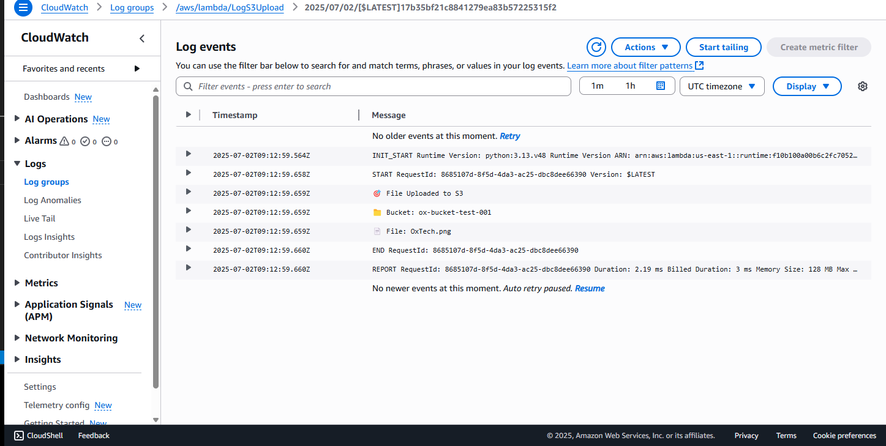

# 🟨 Lambda Triggered by S3 Upload (S3 Event Notification)

This project demonstrates how to automatically run a Lambda function whenever a new file is uploaded to an S3 bucket.

---

## 🔧 What I Did:

### 1️⃣ Created a Lambda Function
- Runtime: **Python 3.13**
- Basic inline function that:
  - Reads the S3 event object
  - Extracts the bucket and object name
  - Logs it using `print()` (visible in CloudWatch)

```python code
import json

def lambda_handler(event, context):
    bucket = event['Records'][0]['s3']['bucket']['name']
    file_key = event['Records'][0]['s3']['object']['key']

    print(f"🎯 File Uploaded to S3")
    print(f"📁 Bucket: {bucket}")
    print(f"📄 File: {file_key}")

    return {
        'statusCode': 200,
        'body': json.dumps('S3 Upload Triggered Successfully!')
    }
```

2️⃣ Created an IAM Role for Lambda
Policy: AmazonS3ReadOnlyAccess

Trusted entity: lambda.amazonaws.com

Attached the role to the Lambda function


3️⃣ Configured S3 Trigger
Enabled event notification on the S3 bucket

Set it to trigger the Lambda whenever a  file is uploaded

Confirmed setup via Lambda > Triggers section

4️⃣ Tested It
Uploaded an image into the bucket

Lambda automatically triggered

Verified logs in CloudWatch

✅ Outcome
Event-driven architecture successfully demonstrated

Proved that serverless compute can respond to storage-level events

## 📸 Screenshot

-   
  *Log output in CloudWatch showing S3 object event triggered successfully*


🔐 Security
No access keys stored anywhere

IAM role used to grant read-only access

Least privilege approach applied

💡 Why This Matters
This shows how modern cloud-native applications can run event-driven code using AWS Lambda + S3 — no need to poll or schedule a job. This is commonly used for:

Auto-processing uploaded files (e.g., images, documents)

Logging and alerting

Starting pipelines or workflows when a file is uploaded.

