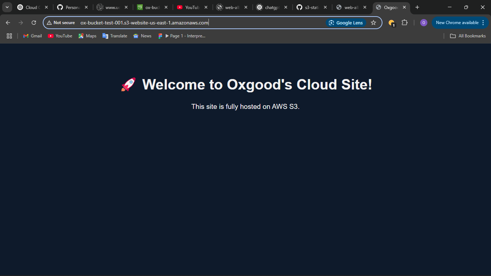

# 🌐 AWS S3 Static Website Hosting

This project demonstrates how I hosted a static HTML website on Amazon S3.

## 🚀 What I Did

- Created an S3 bucket with public access enabled
- Uploaded `index.html` and `error.html` files
- Disabled "Block all public access"
- Added a bucket policy to allow public read access
- Enabled static website hosting
- Accessed the site via the S3 website endpoint

## 🌍 Live Preview

Visit the live site:  
http://ox-bucket-test-001.s3-website-<region>.amazonaws.com

## 🖼️ Screenshots

## 📁 Files Included

- `index.html` – Homepage with inline styling
- `error.html` – Custom 404 error page

## 🧠 What I Learned

- How to configure S3 for static hosting
- The role of bucket policies and public access
- The difference between HTTP and HTTPS in S3 hosting
- The importance of permissions and endpoint types

---

🎓 **Next steps**: I'll later integrate this with CloudFront and Route 53 to serve over HTTPS with a custom domain.

