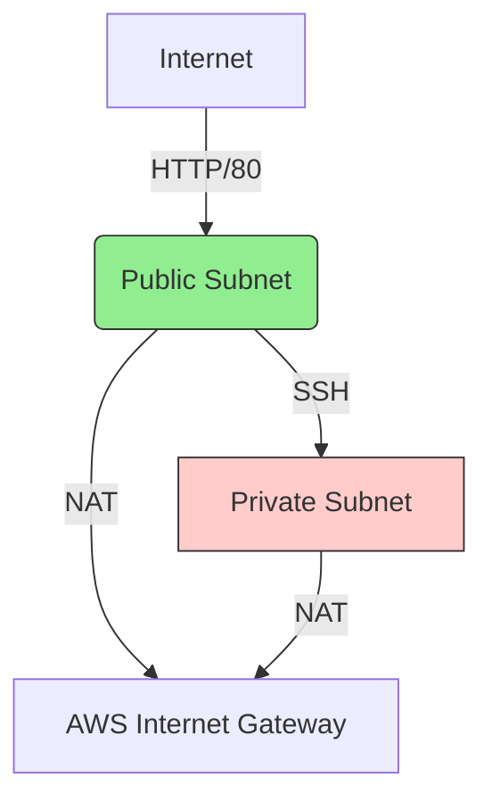

# AWS 2-Tier Architecture with Terraform


A production-ready implementation of a 2-tier AWS architecture following infrastructure-as-code best practices. This project mirrors real-world web application deployments while adhering to the original challenge constraints.

## 🌟 Key Features

- **Real-World Mimicry**: Simulates a typical web application with:
  - Frontend: Ubuntu + Apache in public subnet (handles user traffic)
  - Backend: Ubuntu in private subnet (simulates database/API)
- **Secure Connectivity**:
  - Frontend allows HTTP/80 from the internet and restricted SSH
  - Backend only accepts SSH from the frontend security group
- **Cost-Effective NAT**: Private subnet egress via NAT Gateway
- **Terraform Best Practices**:
  - Modularized for reusability
  - Variables for environment customization

## 📦 Architecture Overview




Components:

Public Tier:
Ubuntu 22.04 + Apache2
Security Group: HTTP open, SSH restricted to your IP

Private Tier:
Ubuntu 22.04 (simulated backend)
Security Group: SSH only from frontend SG

Networking:
VPC with public/private subnets
NAT Gateway for private instance updates
Route tables with IGW/NAT routing


Real-World Use Cases
This architecture is ideal for:

Web Applications (Frontend + Database separation)
API Services (Public-facing endpoints + private logic)
Learning Environments (Safe sandbox for AWS networking)

Deployment

```
    # Initialize Terraform
    terraform init

    # Preview changes
    terraform plan

    # Deploy infrastructure
    terraform apply -auto-approve
```


Post-Deployment:

Access frontend: http://<public-instance-ip>

SSH to backend:

bash
ssh -J ubuntu@<frontend-ip> ubuntu@<backend-private-ip>
🔧 Customization
Edit variables.tf to modify:

AWS region

Instance types

CIDR blocks
SSH allowed IPs

🛡️ Security Note
While this follows the challenge constraints, for production environments consider:

Adding a bastion host (see enhancements/ branch)

Using AWS Systems Manager Session Manager

Implementing WAF for frontend protection